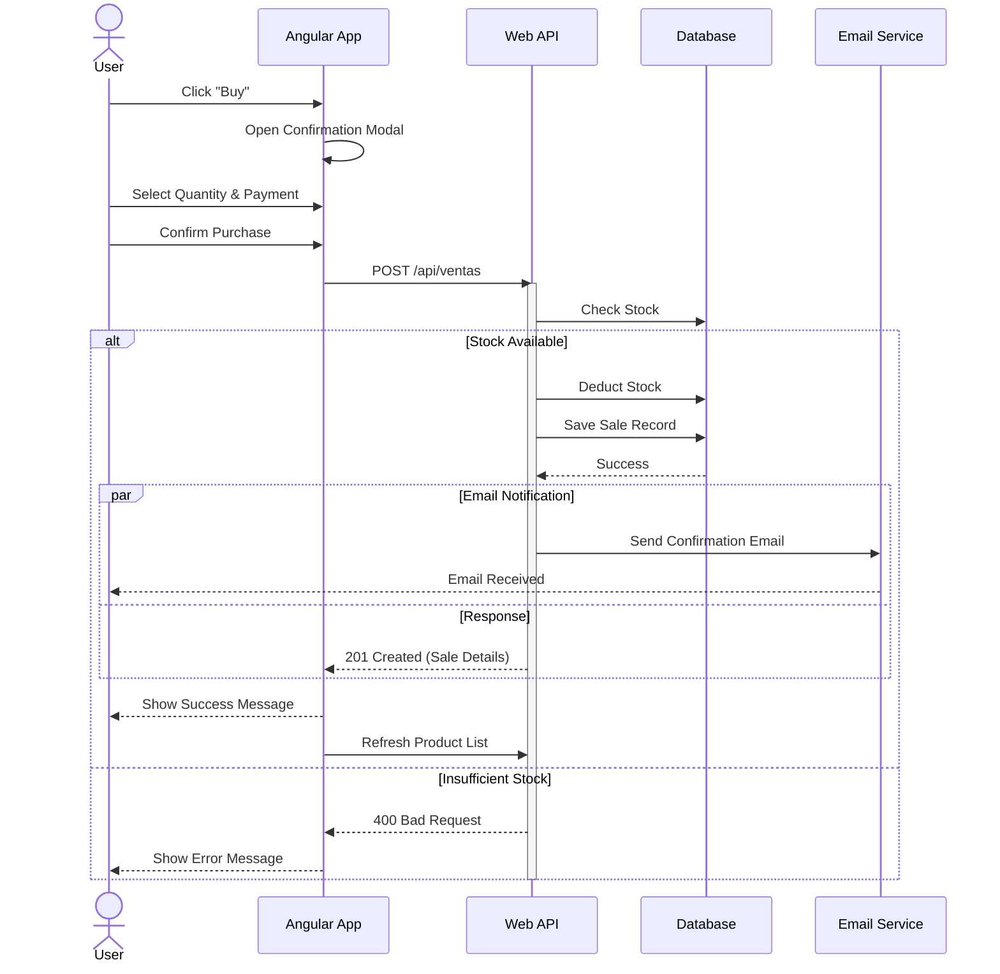

# Firmeza Store System

A comprehensive e-commerce solution featuring a modern Angular storefront, a robust .NET Web API, and an administrative dashboard.

## 🏗 System Architecture

The system is composed of three main projects and a PostgreSQL database.

### Component Diagram

```mermaid
graph TD
    subgraph Frontend
        Client[Angular Client]
        Admin[AdminRazer Panel]
    end

    subgraph Backend
        API[Web API (.NET 8)]
        DB[(PostgreSQL)]
        SMTP[Email Service]
    end

    Client -->|HTTP/REST| API
    Admin -->|EF Core| DB
    API -->|EF Core| DB
    API -.->|SMTP| SMTP
```

### Projects Overview

1.  **Cliente (Angular 18)**: The public-facing storefront where users can browse products, login, and make purchases.
2.  **Web.Api (.NET 8)**: The backend REST API that handles authentication, product data, sales processing, and email notifications.
3.  **AdminRazer (.NET 8)**: A server-side rendered MVC/Razor application for administrators to manage products, view sales, and generate reports.

---

## 🔄 Purchase Flow

The following sequence diagram illustrates the process when a user makes a purchase.

### Purchase Sequence Diagram



---

## 🚀 Getting Started

The easiest way to run the entire system is using Docker Compose.

### Prerequisites
- Docker & Docker Compose

### Run with Docker

1.  **Clone the repository**.
2.  **Configure SMTP**: Update `Web.Api/appsettings.json` or the `docker-compose.yml` environment variables with your real SMTP credentials.
3.  **Run the stack**:

```bash
docker-compose up --build
```

This will start:
- **Web API**: http://localhost:5000
- **Admin Panel**: http://localhost:5001
- **Client**: http://localhost:4200
- **Database**: localhost:5432

### Manual Setup

If you prefer to run projects individually:

1.  **Database**: Ensure PostgreSQL is running and connection strings in `appsettings.json` are correct.
2.  **Web API**:
    ```bash
    cd Web.Api
    dotnet run
    ```
3.  **Admin Panel**:
    ```bash
    cd AdminRazer
    dotnet run
    ```
4.  **Client**:
    ```bash
    cd Cliente
    npm install
    ng serve
    ```

## 🛠 Configuration

### Environment Variables
- `ConnectionStrings__DefaultConnection`: PostgreSQL connection string.
- `Jwt__Key`: Secret key for token generation.
- `EmailSettings__*`: SMTP configuration for sending emails.
