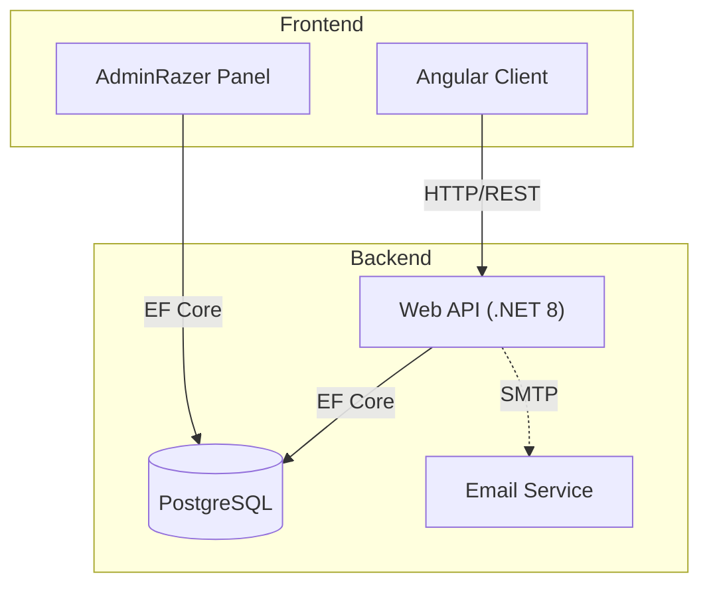
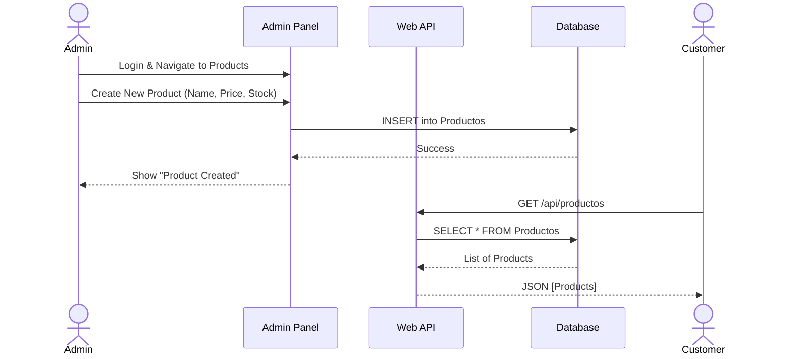
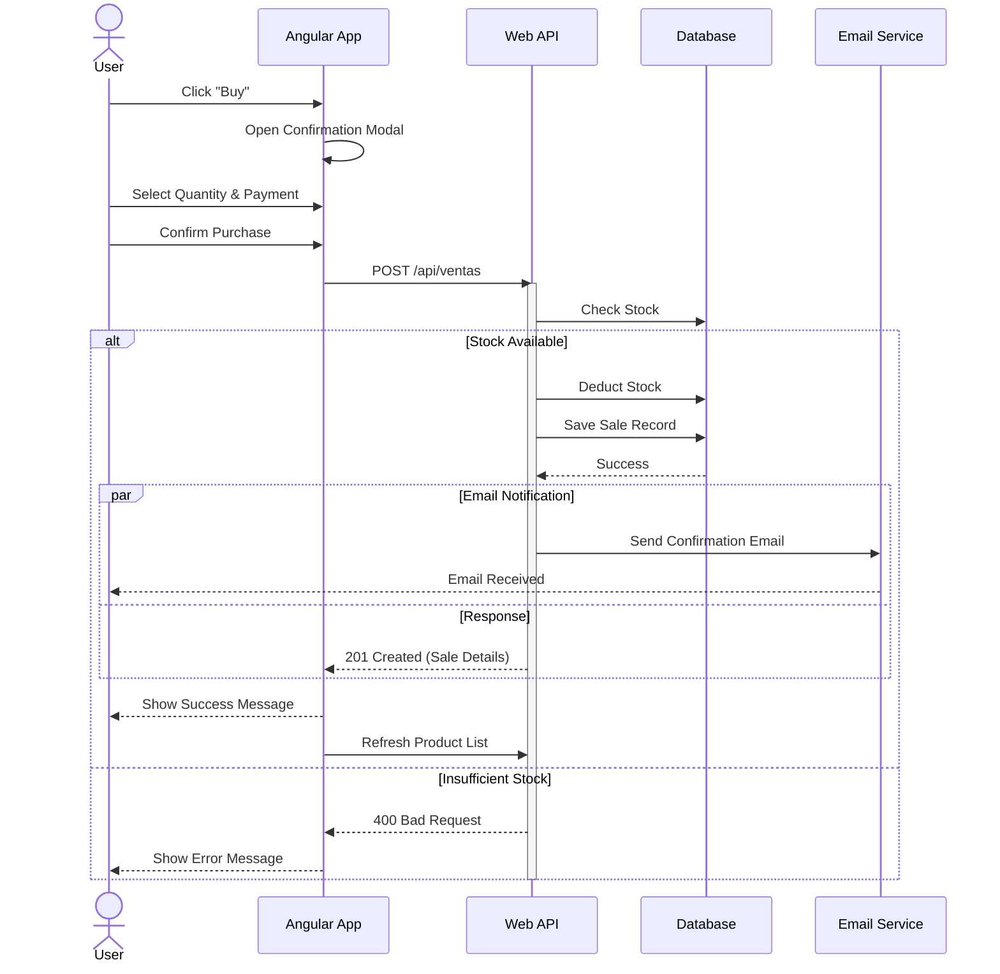

# Firmeza Store System
**Author:** JHON FREDDY PUERTA MENDOZA

A comprehensive e-commerce solution featuring a modern Angular storefront, a robust .NET Web API, and an administrative dashboard.

## 🏗 System Architecture

The system is composed of three main projects and a PostgreSQL database.

### Component Diagram



### Projects Overview

1.  **Cliente (Angular 18)**: The public-facing storefront where users can browse products, login, and make purchases.
2.  **Web.Api (.NET 8)**: The backend REST API that handles authentication, product data, sales processing, and email notifications.
3.  **AdminRazer (.NET 8)**: A server-side rendered MVC/Razor application for administrators to manage products, view sales, and generate reports.
4.  **Firmeza.Tests (xUnit)**: Automated integration and unit tests to ensure system reliability.

### ✨ Key Features

- **Admin Login Restriction**: Administrators are prevented from logging into the Client application to ensure role separation.
- **Automated Testing**: Integration and unit tests run automatically before deployment.
- **Dockerized Deployment**: Full stack deployment with a single command.

---

## 🔄 Purchase Flow

The following sequence diagrams illustrate key processes in the system.

### Product Lifecycle Sequence Diagram

This diagram shows how a product is created by the Admin and then viewed by the Client.



### Purchase Sequence Diagram



---

## 🧪 Automated Tests

The solution includes a comprehensive test suite using xUnit and `Microsoft.AspNetCore.Mvc.Testing`.

### Running Tests Locally

```bash
dotnet test Firmeza.Tests/Firmeza.Tests.csproj
```

### Running Tests in Docker

The tests run automatically as part of the Docker Compose deployment. You can also run them in isolation:

```bash
docker build -f Dockerfile.test -t firmeza-tests .
docker run --rm firmeza-tests
```

---

## 🚀 Getting Started

The easiest way to run the entire system is using Docker Compose.

### Prerequisites
- Docker & Docker Compose

### Run with Docker

1.  **Clone the repository**.
2.  **Configure Environment**:
    -   Ensure `docker-compose.yml` has the correct connection string format for PostgreSQL (ADO.NET format).
    -   Update SMTP settings if you need email functionality.
3.  **Run the stack**:

```bash
docker compose up --build
```

4.  **Troubleshooting**:
    -   If you see `System.ArgumentException` regarding the connection string, ensure you are NOT using the `postgresql://` URI format. Use `Host=...;Database=...;Username=...;Password=...` instead.
    -   If ports are in use, modify the `ports` section in `docker-compose.yml`.

### Access the Services

Once the containers are running (check with `docker ps`), you can access:

-   **Web API (Backend)**: [http://localhost:5000](http://localhost:5000)
-   **Admin Panel (Management)**: [http://localhost:5001](http://localhost:5001)
-   **Client (Storefront)**: [http://localhost:4200](http://localhost:4200)
-   **Database**: localhost:5433 (External port if mapped)

### Manual Setup

If you prefer to run projects individually:

1.  **Database**: Ensure PostgreSQL is running and connection strings in `appsettings.json` are correct.
2.  **Web API**:
    ```bash
    cd Web.Api
    dotnet run
    ```
3.  **Admin Panel**:
    ```bash
    cd AdminRazer
    dotnet run
    ```
4.  **Client**:
    ```bash
    cd Cliente
    npm install
    ng serve
    ```

## 🛠 Configuration

### Environment Variables
- `ConnectionStrings__DefaultConnection`: PostgreSQL connection string.
- `Jwt__Key`: Secret key for token generation.
- `EmailSettings__*`: SMTP configuration for sending emails.
